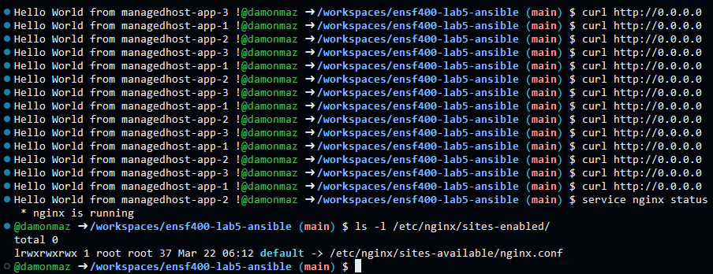
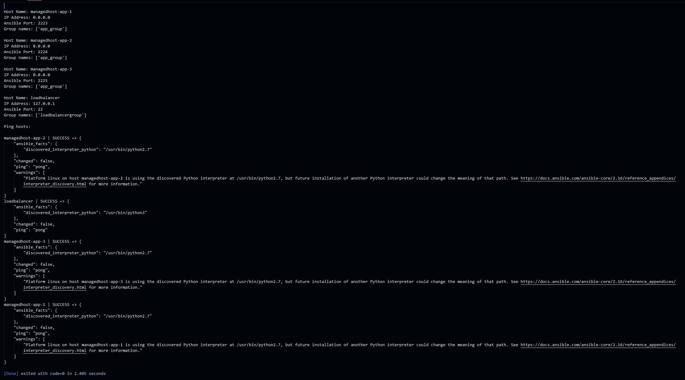
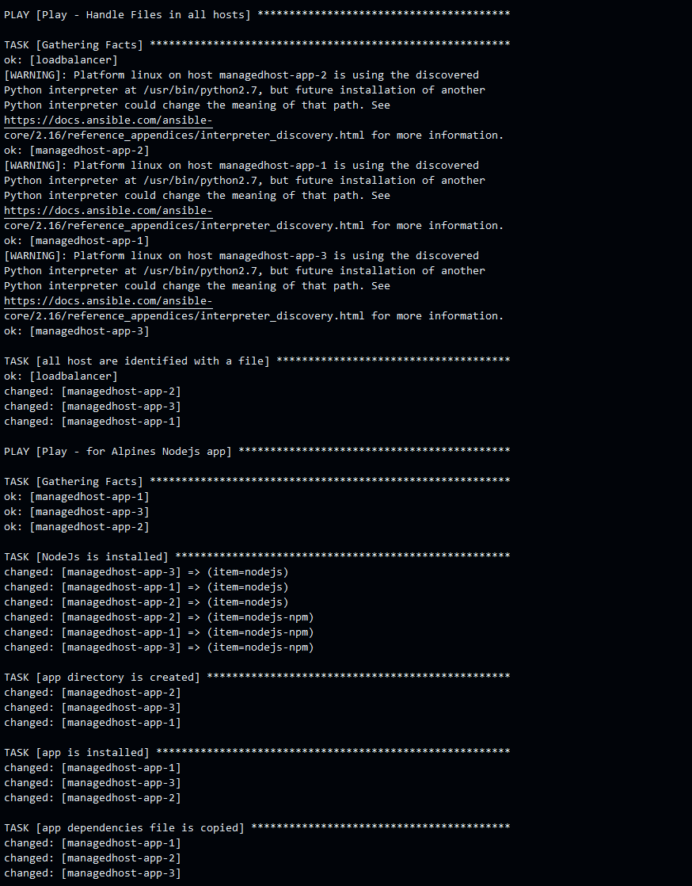
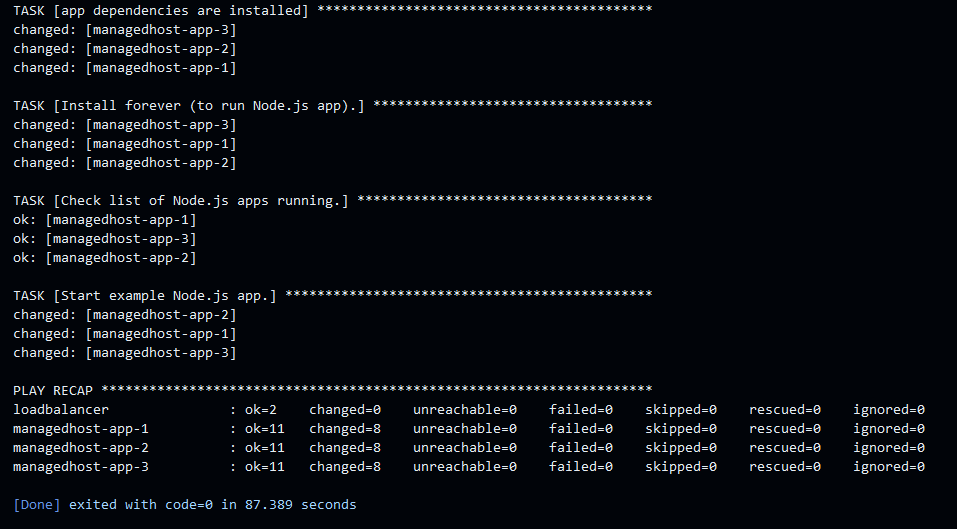

# HOW TO RUN THIS ASSIGNMENT:

## Precursor

Please make sure that this is being in a github codespace, or in directory /workspaces/ensf400-lab5-ansible/, as code in run_playbook.py will not work without hello.yml and hosts.yml in the /workspaces/ensf400-lab5-ansible/ directory. 

## PART 1

I created the load balancer by using Ansible to install the Nginx service on “localhost”.

Start Containers
```bash
docker compose up -d
```
Export
```bash
export ANSIBLE_CONFIG=$(pwd)/ansible.cfg
```
Check that ansible hosts are running
```bash
ansible all:localhost --list-hosts
```
Ping hosts to make sure they are working correctly
```bash
ansible all:localhost -m ping
```
Run playbook
(I decided to add changes to a new file 'hello2.yml' so that I could preserve the original 'hello.yml' from the lab for the second part of this assignment)
```bash
ansible-playbook hello2.yml
```
Show that nginx is running
```bash
service nginx status
```
Check if Nginx config file is present
```bash
ls -l /etc/nginx/sites-enabled/
```
Check if the load balancer is working as expected (run this command many times)
```bash
curl http://0.0.0.0
```

Output should look something like this:

Stop containers
```bash
docker compose down
```
## PART 2
#### **NOTE**: IN ORDER FOR THIS PART TO WORK PROPERLY THE CONTAINERS MUST BE STOPPED FROM THE PREVIOUS PART AND STARTED AGAIN
Start Containers
```bash
docker compose up -d
```

Run 'load_inventory.py'
```python
python load_inventory.py
```

Output should look something like this:


Run 'run_playbook.py'
```python
python run_playbook.py
```
Output should look something like this:

